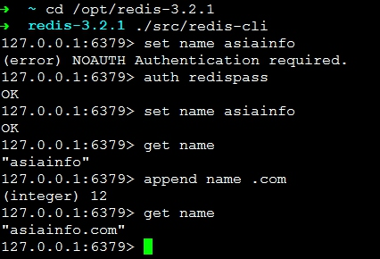

##安装
```shell
wget http://download.redis.io/releases/redis-3.2.1.tar.gz
tar xzf redis-3.2.1.tar.gz
cd redis-3.2.1
make
```
>>redis有非官方支持的windows版本,但生产系统一般都用Linux，本文所用操作系统为CentOS

##运行
1. 服务端：`src/redis-server redis.conf`  
2. 客户端：`src/redis-cli`
  
>>远程连接时需要关闭protected-mode或设置密码：
>> 1. 修改服务器的redis.conf文件，添加*bind 192.168.99.130*  192.168.99.130对应实际的ip地址。连接命令:` ./src/redis-cli -h 192.168.99.130`  
>>2. 临时关闭protected-mode,在服务器本来地客户端连接后执行 `CONFIG SET protected-mode no` 
>>3. 带参数*--protected-mode no*重启服务器
>>4. 在服务器本来地客户端连接后执行`CONFIG set requirepass "redispass"`设置密码，`CONFIG rewrite`保存到配置文件中，下次重启继续生效
>>连接命令：`./src/redis-cli -h 192.168.99.130 -a redispass`

## 常用操作
<http://www.redis.cn/commands.html>有所有命令列表及示例
``` 
set key value 设置指定 key 的值
get key 获取指定 key 的值。
getrange key start end 返回 key 中字符串值的子字符
getset key value 将给定 key 的值设为 value ，并返回 key 的旧值(old value)。
mget key1 [key2..] 获取所有(一个或多个)给定 key 的值。
append key value 如果 key 已经存在并且是一个字符串， APPEND 命令将 value 追加到 key 原来的值的末尾
```

>>redis命令不区分大小写，但key与值是区分大小写的。
>>返回值：不返回实际结果值的情况下成功为1或OK，不成功为0，失败或出差为值负值

```
auth  password             密码验证，相当于登录验证
del    key                       删除key
type  key                      查看key的类型
CONFIG get requirepass  查看密码
save    备份当前数据库到磁盘
flushall 删除所有数据库的所有key
flushdb 删除当前数据库的所有key
```

###批量执行w命令

```
echo "set op pipeline" |./src/redis-cli --pipe

```


## 数据类型
reids中数据用一个key和对应value来表示，key是一个字符串，value可以是string（字符串）、hash（哈希）、list（列表）、set（集合）及zset(sorted set：有序集合)等数据类型。

1.  string 
string是redis中最基本的数据类型，可以表示字符串、数字、一段HTML页面、JSON等文本信息，也可以是二进制数据比如一个jpeg图片(编码后还是字符串，所以本质上还是符串，但存放图片貌似不是个好方式)。可以对期进行修改(set)、追加(append)，指定偏移量的读取(getrange)和修改(setrange)操作。最大512MB。
2.  hash
hash由field和关联的value组成的map。field和value都是字符串,最多可保存Math.pow(2,32)-1个键值对。
操作命令均以h开头如hset,hget,hlen,hdel等
3.  list
按插入顺序排序的字符串元素的集合，可以有重复元素，最多可保存Math.pow(2,32)-1个元素。 
4.  set  
Set是string类型的无序集合。集合成员是唯一的，不能有重复元素，Redis 中的Set是通过哈希表实现的，所以添加，删除，查找的复杂度都是O(1),最多可保存Math.pow(2,32)-1个元素。
5. sorted set
类似Set 不同的是每个元素都会关联一个double类型的分数。redis正是通过分数来为集合中的成员进行从小到大的排序。zset的成员是唯一的,但分数(score)却可以重复

- [] hyperloglog 
//TODO
- [] bitmap
//TODO
- [] geospatial indexes 
//TODO
 
[redis数据类型介绍](http://www.redis.cn/topics/data-types-intro.html)

## 备份及恢复
`save` 创建当前数据库备份
如果需要恢复数据，只需将备份文件 (dump.rdb) 移动到 redis 安装目录并启动服务即可。
>>`CONFIG GET dir`获取备份文件目录 
>>`bgsave` 后台执行save

## API
###  JAVA
1. 依赖：
```        
<dependency>
            <groupId>redis.clients</groupId>
            <artifactId>jedis</artifactId>
            <version>2.8.1</version>
 </dependency>
```
2. 代码示例：   
>>Jedis的方法名和redis的命令名及参数几乎一样。  
>>完整示例请查看<../code/mredis/src/main/java/RedisAPIDemo.java>

```
        Jedis jedis = new Jedis("192.168.99.130",6379);
        //List<JedisShardInfo> shards = Arrays.asList(
        //        new JedisShardInfo("192.168.99.130",6379),
        //        new JedisShardInfo("192.168.99.131",6379));

       //ShardedJedis jedis = new ShardedJedis(shards);


        jedis.auth("password");   //需要密码验证时
         //set name m1234
        jedis.set("name", "m1234");

        //strlen name
        jedis.strlen("name");
        
         //set name m456 EX 5 XX
        //NX:如果key已经存在则不做修改，不存在时则新增  XX:如果key存在则修改，不存在时不会新增
        //EX|PX 过期时间单位，EX:秒,PX:毫秒
        jedis.set("title", "m456", "XX", "EX", 5L);

        //getset title m899
        //设置成新值并返回旧值，没旧值时(key不存在时)返回nil
        jedis.getSet("title", "m899");

        //mget name title
        jedis.mget("name", "title");

        //append   name   789
        //key不存在时，append命令会新增
        jedis.append("name", "789");
        
        //中文
         jedis.set("name-cn".getBytes(),"亚信".getBytes("utf-8"));
         System.out.println(jedis.get("name-cn"));


        //pipeline/事务/一致性hash分布都支持

```

- [ ] Python
//TODO

## 集群&&分布式
[Redis 集群方案介绍了](http://www.open-open.com/lib/view/open1465520425935.html)

Redis 集群通过有三种方案：官方Redis Cluster；通过Proxy分片；客户端分片(Smart Client)。以上三种方案各有利弊。

1. Redis Cluster(官方)：虽然正式版发布已经有一年多的时间，但还缺乏最佳实践；对协议进行了较大修改，导致主流客户端也并非都已支持，部分支持的客户端也没有经过大规模生产环境的验证；无中心化设计使整个系统高度耦合，导致很难对业务进行无痛的升级。

2. Proxy：现在很多主流的Redis集群都会使用Proxy方式，例如早已开源的Codis。这种方案有很多优点，因为支持原声redis协议，所以客户端不需要升级，对业务比较友好。并且升级相对平滑，可以起多个Proxy后，逐个进行升级。但是缺点是，因为会多一次跳转，平均会有30%左右的性能开销。而且因为原生客户端是无法一次绑定多个Proxy，连接的Proxy如果挂了还是需要人工参与。除非类似Smart Client一样封装原有客户端，支持重连到其他Proxy，但这也就带来了客户端分片方式的一些缺点。并且虽然Proxy可以使用多个，并且可以动态增加proxy增加性能，但是所有客户端都是共用所有proxy，那么一些异常的服务有可能影响到其他服务。为每个服务独立搭建proxy，也会给部署带来额外的工作。

3. 客户端分片(Smart Client)。客户端分片是把分片的逻辑放在Redis客户端实现，通过Redis客户端预先定义好的路由规则，把对Key的访问转发到不同的Redis实例中，最后把返回结果汇集，客户端分片相比Proxy拥有更好的性能，及更低的延迟。但增加或者减少Redis实例的数量，需要手工调整分片的程序，后期维护工作可能会稍微麻烦一些。

##主从复制
修改slave配置文件redis.con添加如下内容：
```
# slaveof <masterip><masterport>
slaveof  192.168.99.130  6379
#如果master需要需要密码认证时
#masterauth <password>
masterauth   redispass
```
启动slave后进行测试，在master中写，slave中读取

>>客户端中临时设置:
`of 192.168.99.130 6379 `
`config set masterauth redispass`

<http://redis.cn/topics/replication.html>

###客户端分片


```
        JedisShardInfo host1 =  new JedisShardInfo("192.168.99.130",6379);
        JedisShardInfo host2 =  new JedisShardInfo("192.168.99.131",6379);
        host1.setPassword("redispass");
        host2.setPassword("redispass");
        List<JedisShardInfo> shards = Arrays.asList(host1,host2);

       ShardedJedis jedis = new ShardedJedis(shards);

        for(int i = 0 ; i<=100000; i++){
            jedis.set("sn"+i,"value-" +i);
        }

        jedis.disconnect();
```


## 参考资料
1. [redis 教程](http://www.redis.net.cn/tutorial/3501.html)
2. [redis数据类型介绍](http://www.redis.cn/topics/data-types-intro.html)
3. [Redis 大量数据插入](http://www.redis.cn/topics/mass-insert.html)
4. [五分钟理解一致性哈希算法](http://blog.jobbole.com/102630/)