## Spark应用开发入门

---------------------------------------------------- 

---
## 目标
开发一个简单的Spark和SparkStreaming程序

- 开发工具安装、配置

- scala&java混合项目创建

- 代码开发、运行、打包。
  
---

##  关于开发语言  

Spark官方提供Java、Scala、Python三种API：

- Scala和Java的API完整、稳定  
  
- Python相对scala可能功能上不太完整，新特性支持不及Java&scala及时，但Python语言简单明了，且省去了编译打包，开发相对便捷 
  
---

## spark文档
    
- 官方文档:<http://spark.apache.org/docs/>  :英文，最权威也最全面。
- 汉化的官方文档  <http://ifeve.com/spark/> ：v1.6官方文档汉化版。1.3.0到1.6之间API之间变化不大，可以参考  
-  更多 www.google.com....

---

## 开发工具&&环境

本小节介绍IDEA、以及scala插件的安装。

>>IDEA不是必须的,如果习惯其它开发工具，请自便

--

###  安装IDEA 

- **JDK1.8+** 
   
- [下载IDEA](https://www.jetbrains.com/idea/) :**社区版**即可

- IDEA自带maven，可以不用再单独安装:)   

- **Maven会根据pom.xml中的配置从网络仓库中下载依赖包，所以网速要好^_^**

--

###  安装Scala插件

安装完成后打开IDEA,选择"configure"-> "Plugins"
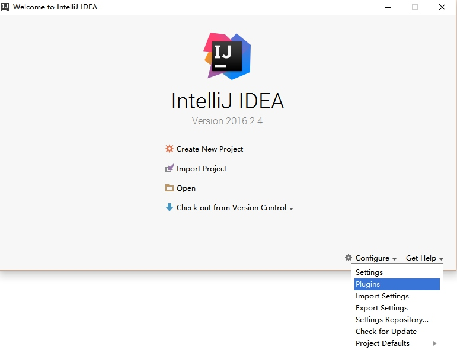 <!-- .element: style="width: 500px;" -->

--

搜索"scala"没有结果，点击"Search in repositories"
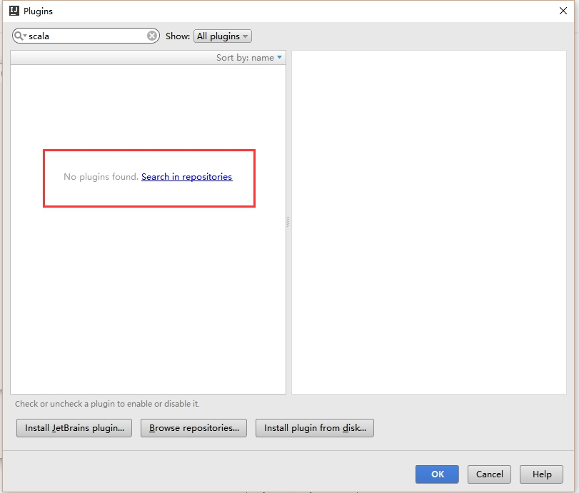 <!-- .element: style="width: 500px;" -->

--

在搜索结果中选择"scala" 选择“install”安装完成后需要重启 

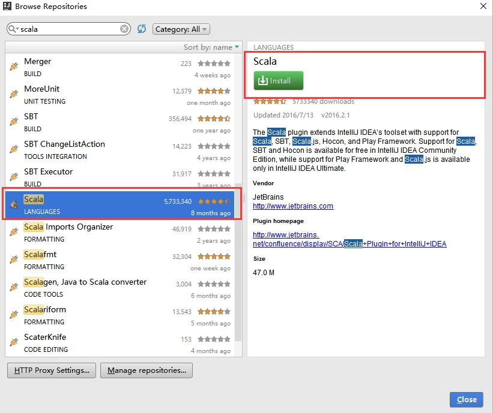 <!-- .element: style="width: 500px;" -->

--
  
- 最新社区版的IDEA在安装完成后的初始界面就已经提供了"scala插件"的安装选择，安装时直接选择即可  
- scala插件是在用scala开发Spark程序时所需要的，如果只是用java开发是用不到的，但考虑到有时候会看spark源码，有这个插件还是方便很多

---

## Spark Wordcount

通过用Scala和Java8分别实现一个简单的统计单词个数的wordcount程序为例，依次介绍工程创建、编码、测试运行、打包的完整过程。

--

新建工程  
"create new project" -> "maven"
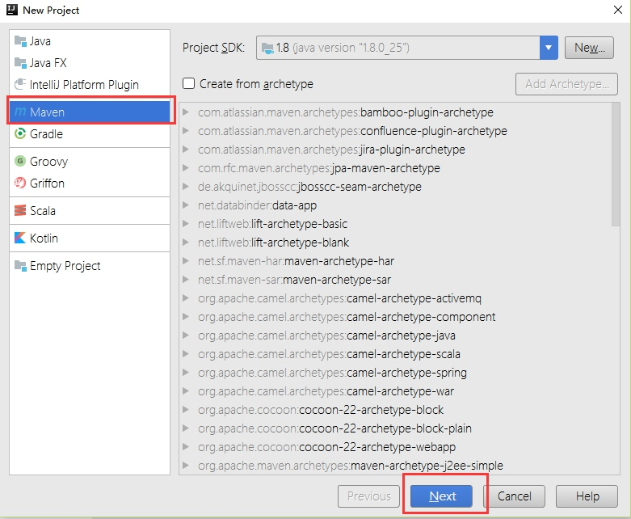 <!-- .element: style="width: 500px;" -->
--
  
填写相关信息  
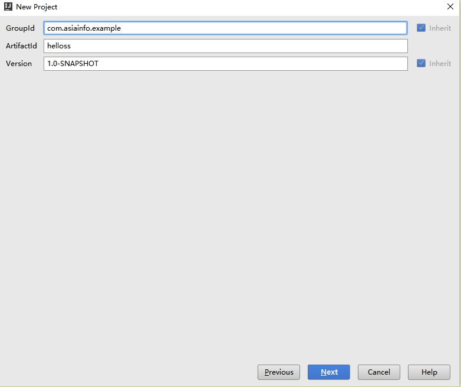 <!-- .element: style="width: 500px;" -->
--
  
创建scala代码目录
新建*main/scala*  
<small>IDEA的maven工程会默认创建java代码的目录，scala代码目录需要手工创建</small>
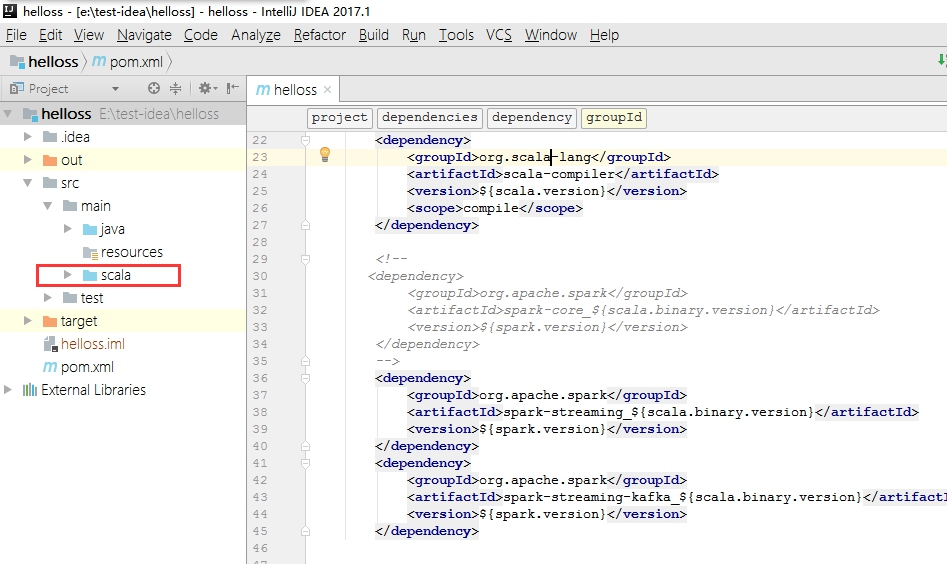 <!-- .element: style="width: 500px;" -->
--

将*main/scala*添加至源代码目录  

"File"->"project structure"->"Modules"->" main/scala" 右键单击，选择 "Sources" 添加至源代码目录
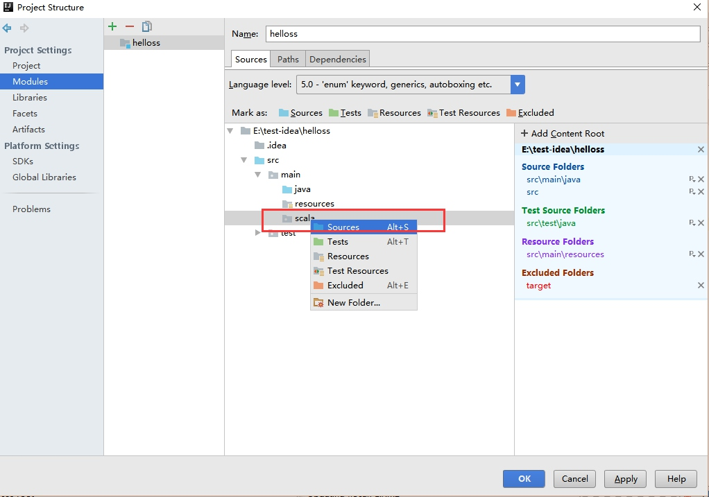 <!-- .element: style="width: 500px;" -->

--

### 声明依赖   

maven的强大在于只需要在pom.xml声明依赖，其余工作由maven完成
本次需要在pom.xml中声明scala库、scala编译插件及spark的依赖，
在pom.xml中`<project>`标签中添加以下内容  
```
<dependencies>
    <!--scala项目需要-->
    <dependency>
        <groupId>org.scala-lang</groupId>
        <artifactId>scala-compiler</artifactId>
        <version>2.10.4</version>
        <scope>compile</scope>
    </dependency>
    <!--spark程序依赖-->
    <dependency>
        <groupId>org.apache.spark</groupId>
        <artifactId>spark-core_2.10</artifactId>
        <version>1.6.1</version>
      </dependency>
    </dependencies>
    <build>
        <plugins>
        <!--scala项目需要-->
            <plugin>
                <groupId>net.alchim31.maven</groupId>
                <artifactId>scala-maven-plugin</artifactId>
                <executions>
                    <execution>
                        <id>scala-compile-first</id>
                        <!--[maven lifecycle](http://maven.apache.org/guides/introduction/introduction-to-the-lifecycle.html)-->
                        <phase>process-resources</phase>
                        <goals>
                            <goal>add-source</goal>
                            <goal>compile</goal>
                        </goals>
                    </execution>
                </executions>
            </plugin>
        </plugins>
    </build>
```
--
### 注意!!


依赖的spark版本和scala的版本要兼容  
`<artifactId>spark-core_${scala.binary.version}</artifactId>`中的*${scala.binary.version}*

--

### 代码开发
样例代码以统计文件中的单词个数为例，单词间以空格分开，计数不区分大小写  
待统计文件就一个本地文本x.txt，内容很简单只有三行：

```   
Java vs Scala  
java8 is good   
scala is better      
```
--

#### scala  

- 在scala目录上右键单击
- 选择“NEW”->"Scala Class"，输入类名"WordCount"  

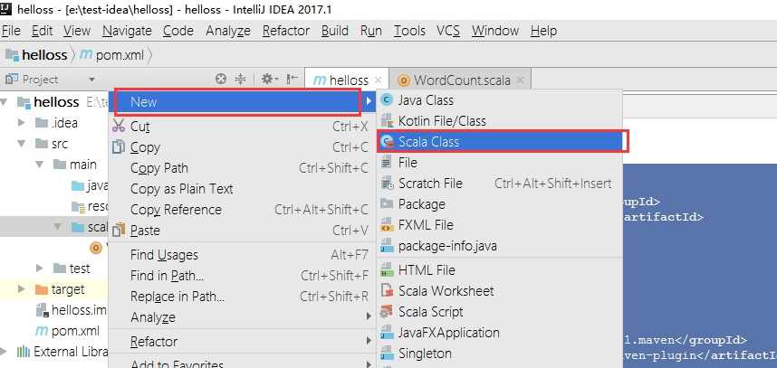 <!-- .element: style="width: 500px;" -->
---------------------------------------

```
//WordCount.scala

object WordCount {
  def main(args: Array[String]): Unit = {
    val conf = new SparkConf().setAppName("WorkCount").setMaster("local[2]")
    val sc = new SparkContext(conf)
    //从文件中创建RDD
    val rdd = sc.textFile("e:/x.txt")
    //文件中的单词用空格区分
    rdd.flatMap(_.split("\\s+"))
      .map(w => (w, 1))
      .reduceByKey(_+_)
      .foreach(println)
  }
}
```
  
>>!! 想想flatMap和Map将数据分别做了什么样的转换?
--

#### **java** 

---------------------------------------

新建Java类JWordCount 

---------------------------------------

```
//JWordCount.java
    public static void main(String[] args) {
        SparkConf  conf = new SparkConf();
        conf.setAppName("JWordCount");
        conf.setMaster("local[2]");
        JavaSparkContext sc = new JavaSparkContext(conf);
        JavaRDD<String> rdd = sc.textFile("e:/x.txt");

        rdd.flatMap(line-> Arrays.asList(line.split("\\s+")))
                .mapToPair(w -> new Tuple2<String,Integer>(w.toLowerCase(),1))
                .reduceByKey((a,b)->a+b)
                .foreach(w-> System.out.println(w));
    }
```

>> 除了需要声明类型外，几乎和scala一样
---

### 运行

- 在左侧"project"窗口右键单击文件，选择“Run 'WordCount'”可以分别运行一下

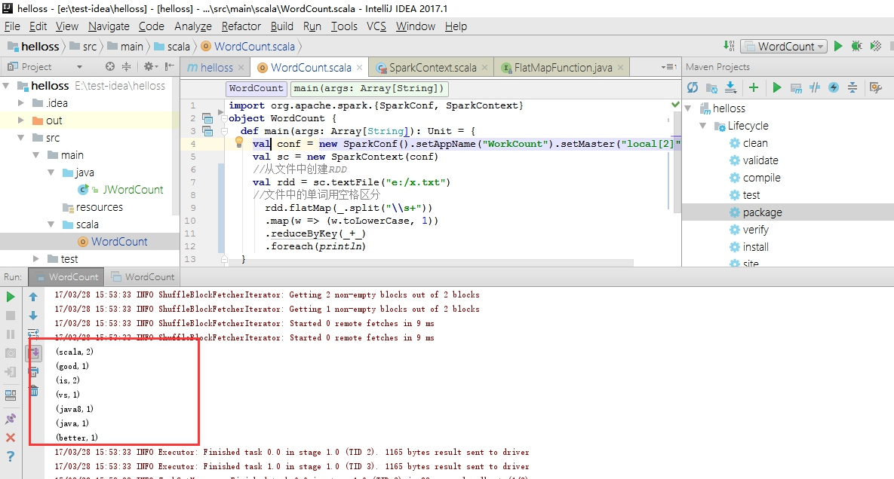 <!-- .element: style="width: 500px;" -->

>> *src/main/java*和*src/main/scala*下分别放java和scala代码。可以用java实现基础代码，在scala中调用
--

### 思考

----------------------------------------

- 不用spark时，程序你会如何写？
  
- 数据量在300万、3千万时、30亿、300亿、3000亿时？

- 单机？分布式？任务划分&调度，容错?


-------------------------------------------------
**spark还是那个spark，调个参数运行而已！**
-------------------------------------------------
--
### 提示
- 一般开发时master不会写死，会由参数传进去，而且生产环境中也不会是*local*模式运行，这种方式可以边开发边测试，不需要部署一套spark集群，提高开发效率。

- 在IDEA中可以通过"Run"->"Editor Configurations"->"添加 or 选择 主类"-> "program arguments" 来添加程序参数，以方便测试，如果开发环境可以直接连接spark集群，可以直接传入master的地址，提交至集群中运行。

---

### 打包  

- Spark程序一会打成jar由`spark-submit`提交至集群中运行

- spark本身及其依赖是不需要打入jar中，其它依赖则需要打包

- 可以用IDEA或Maven打包

--
#### maven

打开"maven project": "view"->"tool windows"->"maven project"
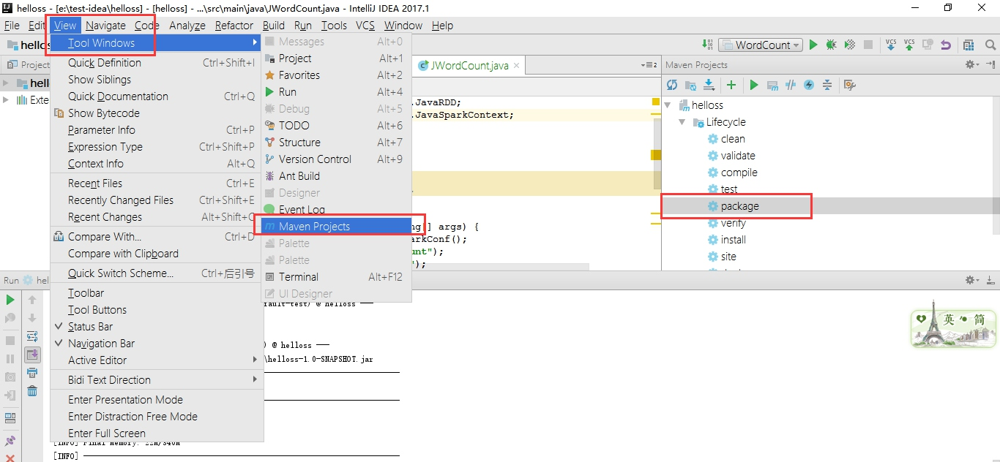 <!-- .element: style="width: 500px;" -->

--
在"maven project" 中选择 "lifecycle"->package 右单击选择"Run Maven Build" 运行结束后，工程中的scala的java都会被编码打包。工程目录下的target/下会有jar包生成
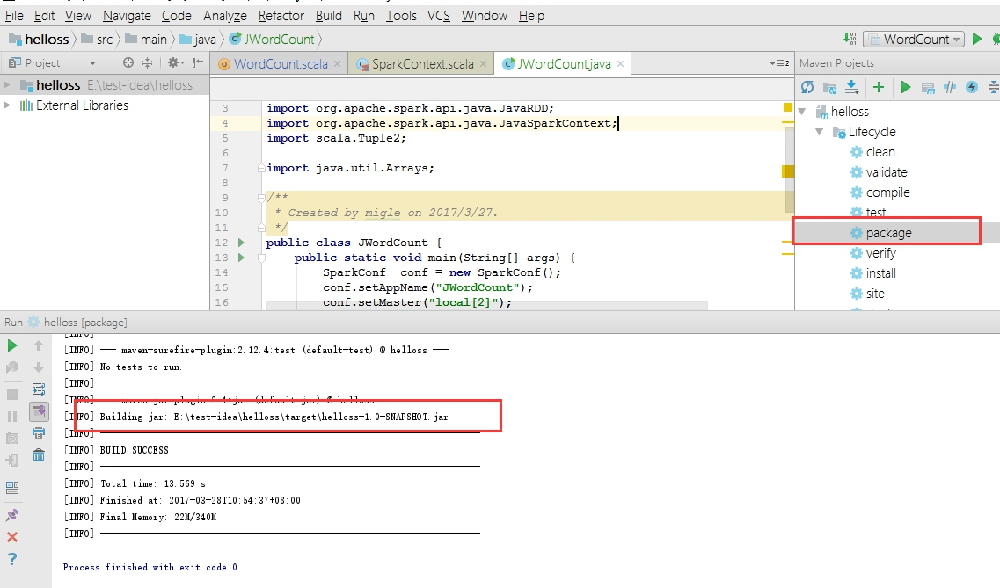 <!-- .element: style="width: 500px;" -->
--

其实只需要一句命令 **`mvn package`**

<small>如果你本地安装好了maven,可以直接在命令行下到pom.xml所在的目录中执行各种maven命令，而不用每次都要在IDEA中执行。maven更多内容和各种NB的插件可以问狗哥或度娘！</small>

--
#### IDEA打包

IDEA要稍显复杂，要多点几次鼠标，需要先创建一个*artifacts*然后在每次需要打包时在*build artifacts*中选择这个*artifacts*执行即可。

--
##### 创建*artifacts*
- "File"->"project structure"->"artifacts"->选择"+" ->"jar"->"empty"
- 在"Name"中填入jar名称 
- "Output directory"为输出jar包的路径
- 在"available elements"中右单击'helloss compile output'选择'pack into Output Root'，点'OK'保存

<small>注意！：'helloss compile output'只是你当前工程中源码编译出来的class。如果要打入其它依赖包，也在此选择加入即可</small>

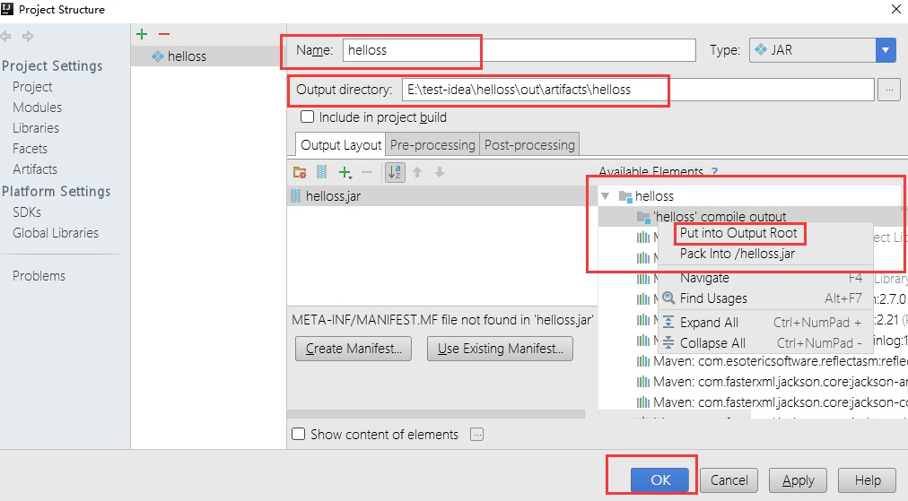 <!-- .element: style="width: 500px;" -->
--

##### 打包
“build”->"build artifacts"->"helloss"(你起的名字)->"build"即可
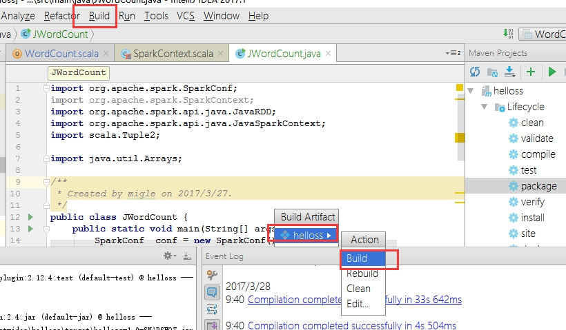 <!-- .element: style="width: 500px;" -->

完整代码见：<https://github.com/longforfreedom/hellospark>  
---

## 部署  
生产环境中是需要将程序提交到集群中运行的，一般用spark-submit来提交，类似以下语句:
```
    spark-submit --master yarn-client  
                 --num-executors 10 
                 --executor-memory 10g 
                 --executor-cores 5  
                 --class "WordCount"   helloss-1.0-SNAPSHOT.jar
```

--
- spark程序可以有多种方式部署在集群中运行,saprk on yarn可能是最常见的方式，具体由**--master** 参数控制  
- 部署方式和运行监控后续会有单独进行介绍，可以参考[官方文档](http://spark.apache.org/docs/1.6.2/submitting-applications.html), 

----------------------------------------------------------------  
<small>一般情况开发的spark程序不会以local方式正式运行，但能以这样方式运行对于开发、测试非常方便，需要注意的是有些情况local方式运行正确，但在集群中不一定能正确运行。因为以local方式运行时Spark的所有角色(Driver,Master,Worker,Executor)f是在本地的同一个JVM中运行，以多个线程运行，具体的任务执行是一个或多个线程，而集群中运行时是不同机器不同的JVM中运行，需要注意并发问题。
</small>
-------------------------------------------------------------

--

## 小结
以上介绍完了IDEA+Maven环境下用scala和java各开发了一个简单单词计数Spark程序的完整过程。包括开发环境搭建，工程创建，代码开发，以及测试运行，打包。

如果数据是动态的，源源不断的，比如来自socket或消息队列中时，要简单及时的处理这些数据时就需要引入流处理技术，SparkStreaming是Spark生态圈中的流处理框架，下面介绍用spark streaming从kafka中统计单词个数的示例程序。
---

### SparkStreaming && Kafka WordCount

用SparkStreaming开发一个流式的WordCount

--
#### 运行环境

如果您不是很了解kafka或着手头没有可以使用的kafka集群，可以用以下方式快速搭建一个测试环境：

本文环境为windows+VMware(Centos)，kafka是在vmware下的centos中运行,

centos的hostname:*vm-centos-00*，IP:*192.168.99.130*

>>kafka也可以直接在windows中运行，运行bin/windows下的启动脚本即可。

--

#### 注意
如果kafka和消费者和服务器以及zookeeper没有在同一台机器上时，需要将kafka server和zookeeper的hostname加到消费者机器的hosts文件中。比如本文中，需要在windows的*C:\WINDOWS\System32\drivers\etc\hosts*文件中添加一条记录`192.168.99.130  vm-centos-00`  否则消费时会出错  

--
#### 安装kafka
1. 下载kafka： `http://mirror.bit.edu.cn/apache/kafka/0.10.2.1/kafka_2.10-0.10.2.1.tgz`  
2. 解压: `tar zxvf kafka_2.10-0.10.2.1.tgz `
3. 启动kafka: 
```
 cd kafka_2.10-0.10.2.1  
 ## 启动zookeeper
 bin/zookeeper-server-start.sh config/zookeeper.properties
 ## 新开一个终端窗口，启动kafka
 bin/kafka-server-start.sh config/server.properties
```
--
#### 测试kafka
4. 创建topic:`bin/kafka-topics.sh --create --zookeeper vm-centos-00:2181 --replication-factor 1 --partitions 3 --topic helloss`   
5. 启动生产者`bin/kafka-console-producer.sh --broker-list vm-centos-00:9092   --topic helloss`    
6. 启动消费者`bin/kafka-console-consumer.sh --zookeeper   vm-centos-00:2181 --from-beginning --topic helloss`     

可以在生产者窗户中输入消息，在消费者窗口中查看。测试无误后可以进入下一步

--
####  创建工程
同spark程序，方便起见可以直接在上面的工作中添加内容即可

--
#### 添加依赖
需要在Spark工程依赖的基础上添加sparkstreaming相关依赖

<small> 由于spark streaming依赖spark core，所以在pom.xml中添加spark streaming后，可以不用显式声明spark core的依赖，spark core的依赖会自动加进来</small>

```
 <dependency>
     <groupId>org.apache.spark</groupId>
     <artifactId>spark-streaming_2.10</artifactId>
     <version>1.6.1</version>
 </dependency>
<!--与kafka集成时需要-->
  <dependency>
     <groupId>org.apache.spark</groupId>
     <artifactId>spark-streaming-kafka_2.10</artifactId>
     <version>1.6.1</version>
 </dependency>
```
--
#### 代码开发  
##### Scala:

```
//SSWordCount.scala
object SSWordCount {
  def main(args: Array[String]): Unit = {
      //方便起间，程序中写死以local方式运行
    val sparkConf = new SparkConf().setAppName("SSWordCount").setMaster("local[2]")
   //每10秒钟统计一次接收到单词数    
    val ssc = new StreamingContext(sparkConf, Seconds(10))
    val topicMap = Map("helloss"-> 1)
    val messages = KafkaUtils.createStream(ssc,"vm-centos-00:2181","ss-group",topicMap)
    val r = messages.map(_._2).flatMap(_.split("\\s+")).map((_,1)).reduceByKey(_+_)
    //只打印10记录，实际中一般会保存到HDFS，Redis,Kafka中
    //spark streaming需要一个Output Operations来触发执行，否则再多的Transformations也不会执行
    r.print(10)
    //启动Streaming程序
     ssc.start()
    ssc.awaitTermination()
  }
}
```
--
##### Java

```
//JSSWordCount.java
 public static void main(String[] args) {
        SparkConf conf = new SparkConf();
        conf.setAppName("JSSWordCount");
        conf.setMaster("local[2]");
        JavaStreamingContext jssc = new JavaStreamingContext(conf, Durations.seconds(20));
        Map<String, Integer> topicMap = new HashMap<>();
        topicMap.put("helloss",1);
        JavaPairReceiverInputDStream<String, String> messages =
                KafkaUtils.createStream(jssc, "vm-centos-00:2181","ss-group",topicMap);
        JavaPairDStream<String, Integer> r = messages.map(x -> x._2())
                .flatMap(line -> Arrays.asList(line.split("\\s+")))
                .mapToPair(w -> new Tuple2<String, Integer>(w.toLowerCase(), 1))
                .reduceByKey((a, b) -> a + b);
        r.print(10);
        jssc.start();
        jssc.awaitTermination();
    }
```

完整代码见：<https://github.com/longforfreedom/hellospark>    

--
#### 运行

运行程序后，在前面打开的生产者窗口中输入消息  
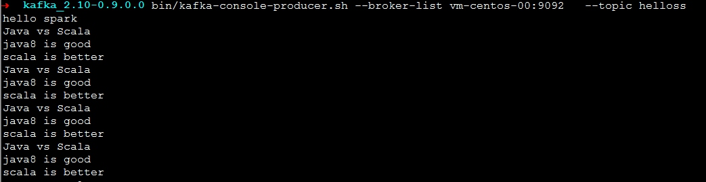 <!-- .element: style="width: 500px;" -->

--
在IDEA中观察输出情况，可以看到类似如下输出：
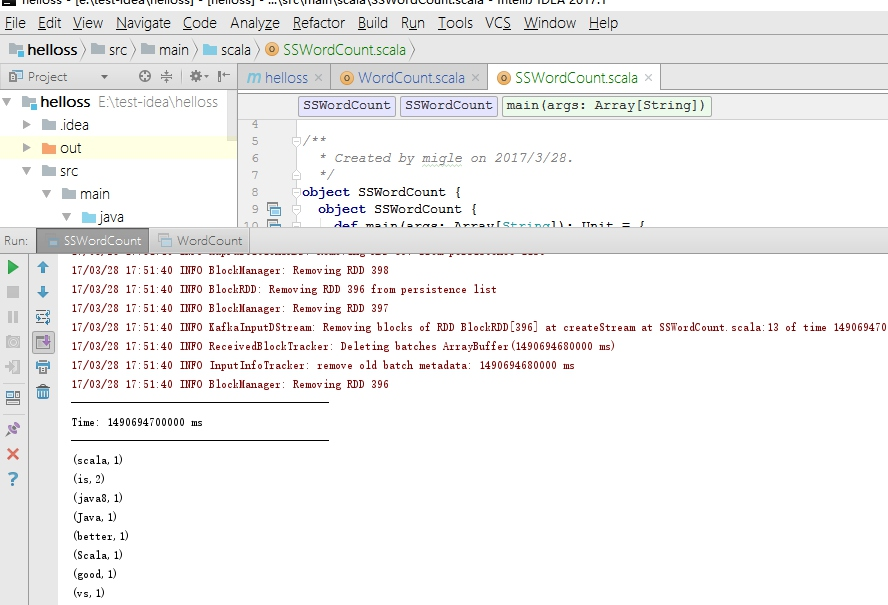 <!-- .element: style="width: 500px;" -->
--

可以通过Spark Web UI<http://localhost:4040/>来监控流处理程序运行情况，比如延迟多少批次，已处理完成多少个批次等等,如下图所示

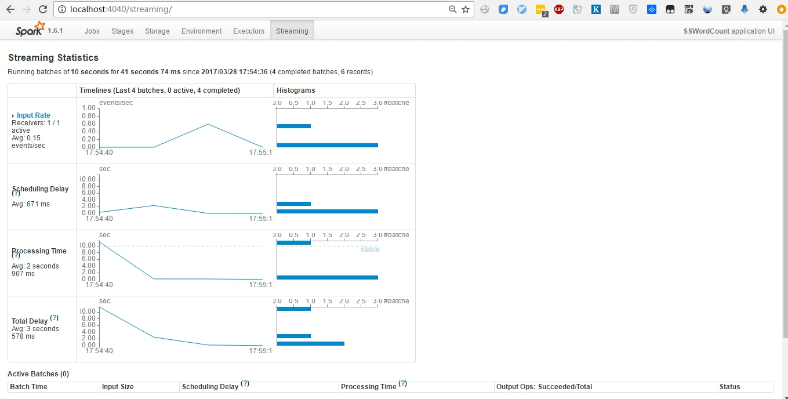 <!-- .element: style="width: 500px;" -->
--

#### 注意
打包、部署运行和spark程序没有区别，但需要注意的是spark程序处理结束后会自动退出，释放资源。而spark streaming处理的是连续不断的数据，程序不会退出，即使kafka中没有数据也不会释放资源，更不会退出，真到人为结束(出错了当然就结束了:( )
---
### 结束
本文只是简单的介绍了开发工具安装、配置，并通过两个简单的例子介绍了IDEA+Maven环境下使用Java8和Scala的开发spark和spark streaming程序的过程。

