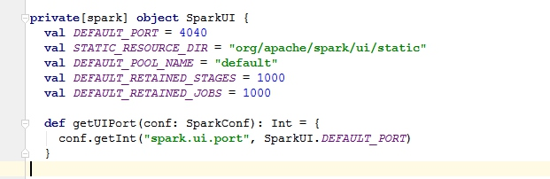
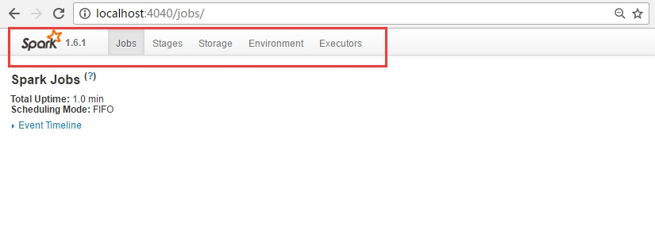
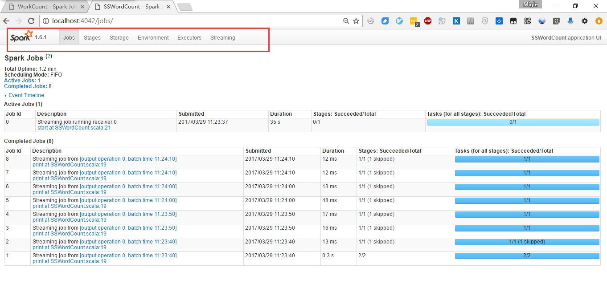
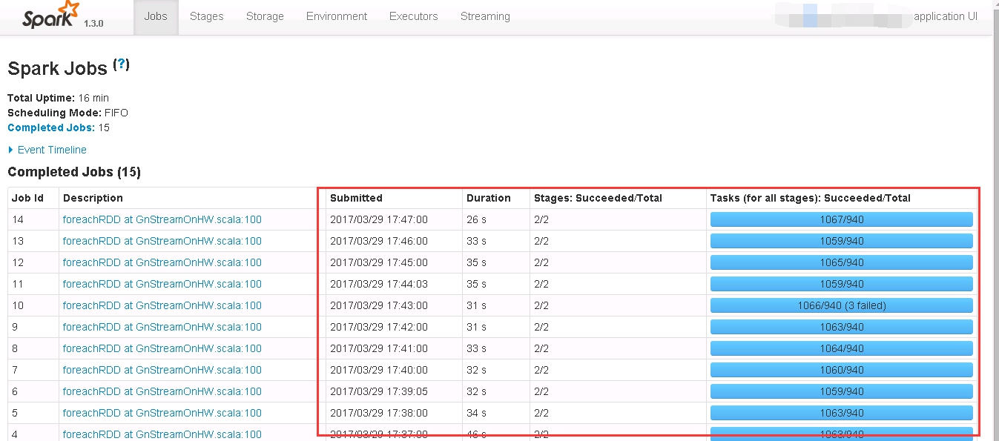
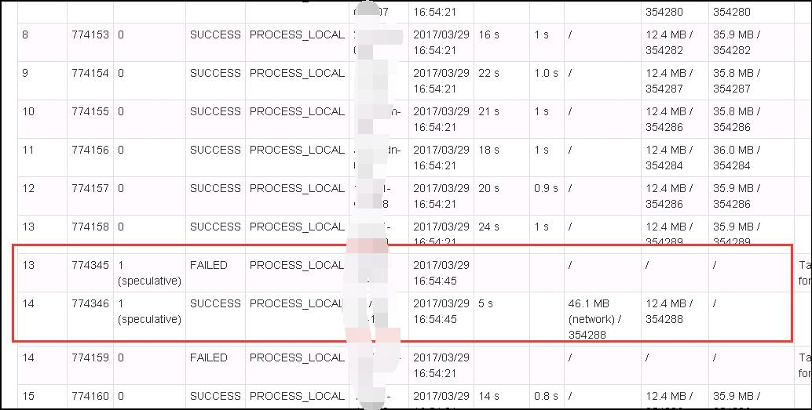
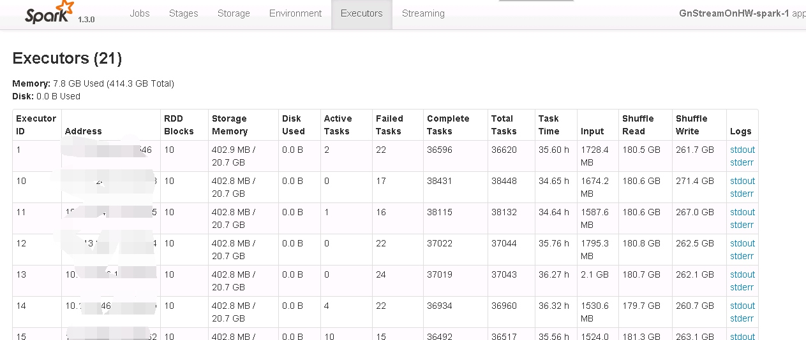
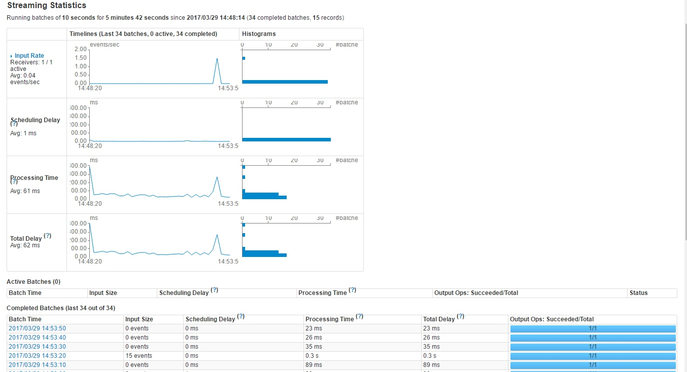
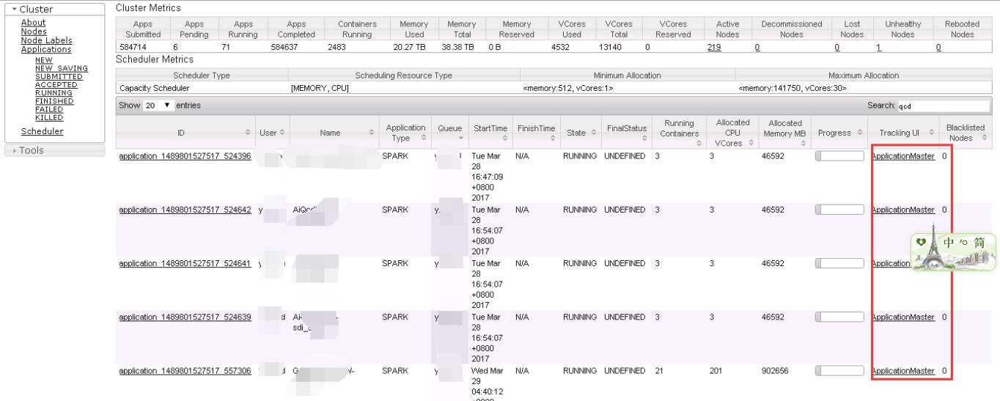
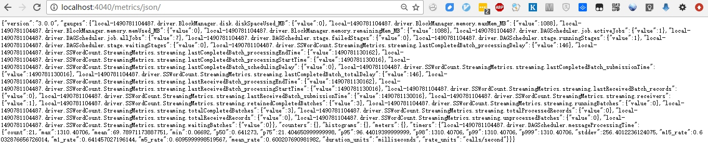

运行监控对系统的重要性不言而喻，尤其是分布式环境中，程序运行是否正常，在哪些节点上运行，每个节点处理的数据量是否均匀，每个任务的处理时间是否大致均衡，在流处理程序中每个批次是否能及时处理，是否有批次延迟，这些信息都是必须要监控的重要信息，也是程序优化的基础。对于以上信息可以通过spark自带的WEB UI来监控，默认已经开启。spark也提供了与第三方监控系统的接口，本文只介绍spark自带的WEB UI中的监控信息。

每个程序的启动会占用driver侧一个端口，默认为*4040*，由参数**spark.ui.port**控制。

可以在driver侧的配置文件中设置默认端口或提交运行时通过参数指定 `--conf spark.ui.port=4141`
当然也可以在代码中写死`val conf = new SparkConf().set("spark.ui.port","4141")  `
如果在同一台机器上会提交大量作业时需要注意，如果默认端口已被占用，会在此端口基础上+1再试，不行再+1一直持续成功或超过`spark.port.maxRetries`指定的次数还没有成功的话，任务启动失败，所以这种情况最好通过参数`--conf spark.ui.port=xxxxx`给每个作业都指定端口。

以下界面分别[spark应用开发-开发工具篇](./spark应用开发-开发工具篇.md)介绍的两个示例程序的监控页面。
//spark

//spark streaming

相对于spark程序spark streaming程序的web ui中除了"Jobs"、"Stages"、"Storage"、"Environment"、"Executors"外还多了一个“streaming”标签。
*Jobs*: job列表，显示每个作业的时间信息以及共有多少stage以及task，可以链接到具体的stages页面,这个页面需要重点关注每个job的时间，以及是否有作业有大量的失败的任务。

*Stages* :Stage列表，显示stage的输入、输出以及Shuffle读写的数据量，并且可以链接到每一个task的执行情况，包括执行次数，task状态，locality级别、GC时间，输入、输出数据量等等，这里面需要重点关注task的执行时间，gc时间，以及各task花费时间相差是否不大。
比如下图中有任务第一次没有执行成功

>>locality_level按优先级高低排：PROCESS_LOCAL，NODE_LOCAL，NO_PREF，RACK_LOCAL，ANY。也就是最好在同个进程里，次好是同个node(即机器)上，再次是同机架，或任意都行

*Storage*: 存储情况
*Environment*：环境信息、各种各样的参数信息。可以在这里看到实际spark.ui.port是多少
*Executors* :executor列表，在这里查看到各个executor输出的日志，如下图就是一个实际程序的截图，可以通过stdout/stderr查看日志。

*streaming*： 显示每个批次有多少数据，总共处理了多少批次，每个批次处理花费的时间，是否有批次延迟等信息，如下图是一个正运行的streaming程序的监控页面。

重点需要关注的是*active batches*，如果*active batches*下面的批次大于1则证明有延迟批次
*streaming statistics*:中显示的事件的数据接收、调度延迟、处理时间，合计延迟的统计信息。
*completed batches* :已完成批次(只显示是最近)的信息，可以通过链接进行具体的Job中。如果发现某批次处理时间有异常，可以通过链接看到具体的Job信息，进而查看到stage,最终追踪到具体的task中，比如下图就是“Stage”标签中。

## spark on yarn中的监控
spark on yarn在的环境中，要通过yarn的页面才能正确进入到监控页面。如下图点tracking ui才能正确进入页面。

## 其它
还可以用脚本通过http://localhost:4040/mertics/json获取的json格式的监控信息，格式类似下面

可以用python很容易的解析出来具体内容，最近一批次消息数据，处理延迟、处理时间等的信息。

